# 🛠️ Setup Guide — AI Stock Market Research Assistant

> Step-by-step record of the environment setup and pipeline build.
> Follow this guide to reproduce the project from scratch on any Databricks Free Edition workspace.
> Screenshots throughout are from the actual working deployment — see [`screenshots/`](screenshots/).

---

## Prerequisites

- Databricks Free Edition account ([signup](https://databricks.com))
- GitHub account
- Massive Stocks API account ([signup](https://massive.com))

---

## ⚠️ Free Edition Constraints & Workarounds

| # | Constraint | Impact | Workaround |
|---|---|---|---|
| 1 | `api.massive.com` blocked by outbound domain filter | Cannot call Massive API directly | Use `api.polygon.io` — same key (Massive rebranded from Polygon.io Oct 2025) |
| 2 | Massive **free tier = end-of-day (EOD) data only** | No real-time intraday prices | Pipeline ingests previous day's OHLCV close via `/prev` endpoint — real, accurate data, just not intraday |
| 3 | OAuth JWT federation unavailable | Cannot connect Lakebase CDF to Delta directly | Delta Lake native `enableChangeDataFeed` used — identical CDC pattern |

---

## ✅ Step 1 — GitHub Repository

| Field | Value |
|---|---|
| Owner | `demonjd2026-afk` |
| Repository name | `ai-stock-research-assistant` |
| Visibility | Public |
| Repo URL | `https://github.com/demonjd2026-afk/ai-stock-research-assistant` |

---

## ✅ Step 2 — LinkedIn Identity Verification

Databricks Free Edition restricts outbound internet by default. LinkedIn verification unlocks it.

1. Log into Databricks workspace
2. Click **"Verify identity"** in the top-right header
3. Complete the LinkedIn OAuth flow

---

## ✅ Step 3 — Databricks Personal Access Token

| Field | Value |
|---|---|
| Name | `capstone-token` |
| Lifetime | 90 days |
| Scope | Other APIs |
| API scope | `all-apis` |

**How:** Settings → User → Developer → Generate new token

---

## ✅ Step 4 — Connect GitHub Repo to Databricks

1. Workspace → Create → Git folder
2. URL: `https://github.com/demonjd2026-afk/ai-stock-research-assistant`
3. Provider: GitHub (already linked via OAuth)

> Databricks does NOT auto-sync. Pull manually after every GitHub push.

---

## ✅ Step 5 — Massive Stocks API Key

| Field | Value |
|---|---|
| Provider | [Massive Stocks API](https://massive.com) (rebranded from Polygon.io) |
| Tier | Free (5 requests/minute) |
| Key length | 32 characters |
| Working base URL | `https://api.polygon.io` |

> **Note:** `api.massive.com` is blocked by the Databricks Free Edition network filter.
> Use `api.polygon.io` — same API key works (Massive rebranded from Polygon.io Oct 2025).

> **Data tier note:** Massive's **free subscription tier provides end-of-day (EOD) data only** — not real-time intraday prices. Real-time tick-level trades and quotes require a paid Massive plan. This pipeline ingests the **previous trading day's closing OHLCV** via the `/v2/aggs/ticker/{ticker}/prev` endpoint. The pipeline is scheduled to run after US market close (10 PM IST / 4:30 PM UTC) so the EOD data is always current as of the latest trading day.

---

## ✅ Step 6 — Databricks Secrets Setup

| Field | Value |
|---|---|
| Scope name | `capstone` |
| Secret key | `massive_api_key` |
| Value | Massive Stocks API key (32 chars) |

**Secure storage using `getpass` (never hardcode):**

```python
import getpass
from databricks.sdk import WorkspaceClient

api_key = getpass.getpass("Paste Massive API key: ")
w = WorkspaceClient()
try:
    w.secrets.create_scope(scope="capstone")
except Exception:
    pass
w.secrets.put_secret(scope="capstone", key="massive_api_key", string_value=api_key)
api_key = None
print("Done")
```

**Access in any notebook:**
```python
api_key = dbutils.secrets.get(scope="capstone", key="massive_api_key")
```

Confirmed working in the pipeline — the key loads from Secrets at runtime and the base URL resolves to Polygon:

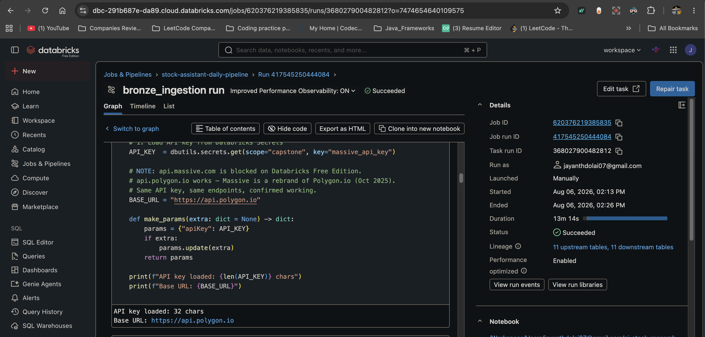

---

## ✅ Step 7 — Lakebase Project Created

| Field | Value |
|---|---|
| Project name | `stock-assistant` |
| Type | Autoscaling |
| Branch | `production` |
| Database | `databricks_postgres` |
| Postgres version | 17 |
| Compute | 1 CU, scale to zero |
| Region | AWS (us-east-2) |

**URL:** `https://dbc-291b687e-da89.cloud.databricks.com/lakebase/projects`

---

## ✅ Step 8 — Lakebase Schema Executed

Run `lakebase/05_schema_ddl.sql` in the Lakebase SQL Editor.

**Tables created (8 total):**

| Table | Size | Purpose |
|---|---|---|
| `analysis_reports` | 40 kB | Agent-generated reports per session |
| `companies` | 24 kB | Company profiles and fundamentals |
| `news_articles` | 32 kB | Raw news text (also embedded for RAG) |
| `price_snapshots` | 32 kB | OHLCV snapshots per ticker |
| `research_notes` | 32 kB | User-authored notes per ticker |
| `users` | 32 kB | Registered users |
| `watchlist_tickers` | 32 kB | Tickers within each watchlist |
| `watchlists` | 32 kB | Named watchlists per user |

> `REPLICA IDENTITY FULL` is set on all 8 tables to enable Change Data Feed (CDF).

---

## ✅ Phase 2 — Bronze Ingestion Pipeline

**Files:**
- `pipeline/00_setup_config.ipynb` — ticker registry in Unity Catalog
- `pipeline/01_bronze_ingestion.ipynb` — raw data ingestion

### Ticker Config Table (`main.config.ticker_config`)

Tickers are stored in Unity Catalog — not hardcoded in notebooks.

| Field | Value |
|---|---|
| Table | `main.config.ticker_config` |
| Seeded tickers | 20 across 5 sectors |
| Active on first run | 5 (AAPL, GOOGL, META, MSFT, NVDA) |
| Active in current deployment | **All 20** — activated via SQL after the pipeline was proven |

**To activate more tickers:**
```sql
-- All tickers (what the current deployment runs)
UPDATE main.config.ticker_config SET active = true;

-- One sector
UPDATE main.config.ticker_config SET active = true WHERE sector = 'Finance';

-- One ticker
UPDATE main.config.ticker_config SET active = true WHERE ticker = 'JPM';

-- Deactivate
UPDATE main.config.ticker_config SET active = false WHERE ticker = 'META';
```

Adding or removing tickers never requires a code change — the Bronze notebook reads the active list at runtime.

### Bronze Delta Tables (`main.bronze`)

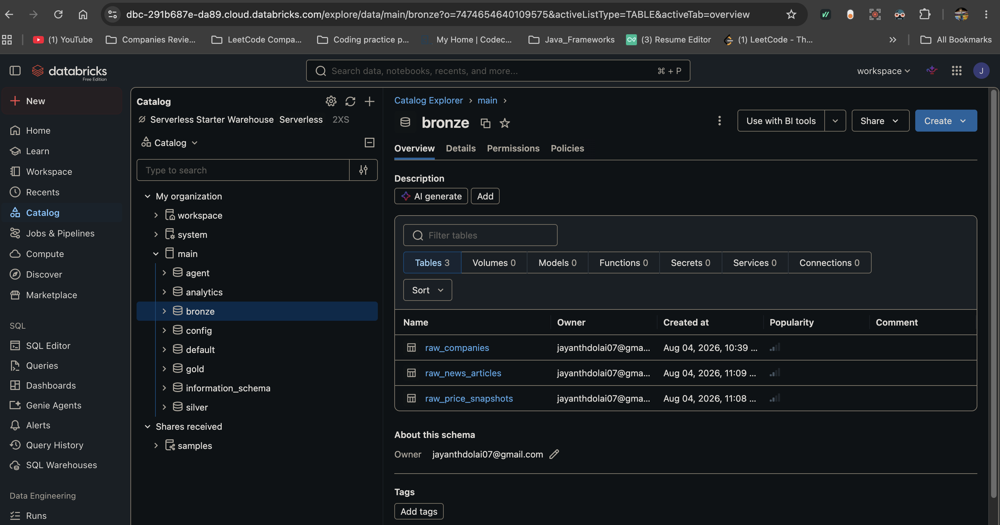

| Table | Source Endpoint |
|---|---|
| `raw_companies` | `GET /v3/reference/tickers/{ticker}` |
| `raw_price_snapshots` | `GET /v2/aggs/ticker/{ticker}/prev` |
| `raw_news_articles` | `GET /v2/reference/news` |

**Verified production run** — batch `073b93e9-3080-4ea1-baa1-203487f6b10b`, run date `2026-08-06`, all 20 tickers active:

| Table | Rows this run | Cumulative total |
|---|---|---|
| `main.bronze.raw_companies` | 20 | 115 |
| `main.bronze.raw_price_snapshots` | 20 | 95 |
| `main.bronze.raw_news_articles` | 118 | 630 |

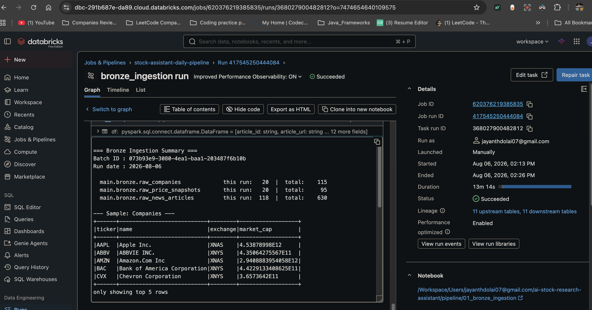

**Sample company rows from that run:**

| Ticker | Name | Exchange | Market Cap |
|---|---|---|---|
| AAPL | Apple Inc. | XNAS | 4.5388e12 |
| ABBV | ABBVIE INC. | XNYS | 4.3506e11 |
| AMZN | Amazon.Com Inc | XNAS | 2.9409e12 |
| BAC | Bank of America Corporation | XNYS | 4.2229e11 |
| CVX | Chevron Corporation | XNYS | 3.6574e11 |

**Key design decisions:**
- `raw_json` column stores the full API response — nothing lost at Bronze layer
- `batch_id` (UUID per run) on every row enables lineage tracking
- **Idempotent MERGE upsert** on each feed's natural key — a retry or same-day re-run updates in place rather than appending duplicates
- Schema evolution via the `mergeSchema` write option — handles API schema changes gracefully
- 13-second sleep between API calls — respects free tier rate limit (5 req/min)
- All numeric fields explicitly cast to prevent Spark type inference errors

### Bronze Idempotency

Bronze originally wrote with `mode("append")`, which meant a job retry or manual re-run
appended a second copy of the same trading day. Silver's dedup hid the effect downstream,
but Bronze row counts inflated and true replay was impossible.

`upsert_bronze(rows, table, keys)` (cell 6) now MERGEs on the natural grain of each feed:

| Table | Merge key | On match | Why |
|---|---|---|---|
| `raw_companies` | `(ticker, run_date)` | Update | One profile per ticker per day; a same-day re-fetch is a correction |
| `raw_price_snapshots` | `(ticker, snapshot_date)` | Update | One OHLCV bar per ticker per trading day; restated closes should win |
| `raw_news_articles` | `(article_id, ticker)` | **Insert only** | A published article never changes; rewriting it would clobber lineage |

The split matters. The first two keys include the date, so a match can only be a
same-day re-fetch and the newer value is the better one. The news key deliberately
ignores `run_date` — the same article is re-returned for days — so `whenMatchedUpdateAll`
would match every historical copy and stamp them all with the current `batch_id`,
destroying the per-run lineage Bronze exists to preserve. News therefore uses
`update_existing=False` (`whenNotMatchedInsertAll` only).

Two details worth noting:
- The batch is deduplicated on the key **before** the MERGE — Delta raises an error if two source rows match the same target row, which happens whenever one article is returned for multiple tickers.
- The join uses `<=>` (null-safe equality) so a null key never silently produces duplicates.
- On first run the table doesn't exist yet, so the helper falls back to a plain create-by-append.
- Schema evolution uses a zero-row `mergeSchema` append, applied only when the batch introduces a new column. Serverless rejects `spark.databricks.delta.schema.autoMerge.enabled` outright (`CONFIG_NOT_AVAILABLE.SERVERLESS_DELTA_SCHEMA_AUTO_MERGE_ENABLED`), so the write option is the supported path.

### Known Issue & Fix — Serverless schema auto-merge

| Issue | Cause | Fix |
|---|---|---|
| `CONFIG_NOT_AVAILABLE.SERVERLESS_DELTA_SCHEMA_AUTO_MERGE_ENABLED` | `spark.conf.set("spark.databricks.delta.schema.autoMerge.enabled", ...)` is not settable on Serverless compute | Drop the conf; evolve the target with a zero-row `.option("mergeSchema", "true")` append before the MERGE |

### Notebook Logic — `01_bronze_ingestion.ipynb` (11 cells)

**Cell 0 — Header banner.** File identification comment block.

**Cell 1 — Markdown.** Layer description, catalog/schema targets.

**Cell 2 — Imports and config.**
Imports `requests`, `json`, `uuid`, `time`, `datetime`. Generates a unique `BATCH_ID` (UUID) per run used for lineage tracking across all three tables. Sets `RUN_DATE` and `INGESTED_AT` timestamps.

**Cell 3 — Load API key.**
Loads the Massive API key securely from Databricks Secrets:
```python
API_KEY  = dbutils.secrets.get(scope="capstone", key="massive_api_key")
BASE_URL = "https://api.polygon.io"  # api.massive.com blocked on Free Edition
# Note: Massive free tier = EOD data (prev day close). Real-time requires paid plan.
```
Auth is passed as a query parameter `?apiKey=KEY` — not a Bearer header.

**Cell 4 — Load active tickers from Unity Catalog.**
Instead of hardcoding tickers, the notebook reads from `main.config.ticker_config`:
```python
TICKERS = [
    row.ticker for row in
    spark.sql("SELECT ticker FROM main.config.ticker_config WHERE active = true ORDER BY ticker")
    .collect()
]
```

**Cell 5 — API helper function.**
`api_get(endpoint, params, retries=3)` wraps every API call with:
- Automatic retry (3 attempts)
- 429 rate limit detection → waits 60 seconds then retries
- Timeout of 15 seconds per request
- Returns parsed JSON or `None` on failure

**Cell 6 — Create Bronze schema + idempotent upsert helper.**
`CREATE SCHEMA IF NOT EXISTS main.bronze`, enables Delta schema auto-merge, and defines
`upsert_bronze()` — see [Bronze Idempotency](#bronze-idempotency) above.

**Cell 7 — Company fundamentals ingestion.**
Calls `GET /v3/reference/tickers/{ticker}` per ticker.
Extracts: name, exchange, market_cap, description, homepage_url, total_employees, list_date, sic_code, sic_description, locale, currency_name, active, type.
Adds `batch_id`, `run_date`, `raw_json` (full API response), `ingested_at`.
Writes via `upsert_bronze(..., keys=["ticker", "run_date"])`.

**Cell 8 — OHLCV price snapshots ingestion.**
Calls `GET /v2/aggs/ticker/{ticker}/prev` per ticker.
Extracts: open (o), high (h), low (l), close (c), volume (v), vwap (vw), transactions (n), timestamp_ms (t).
**Critical fix:** all numeric fields explicitly cast to `float()` or `int()` to prevent Spark type inference conflicts:
```python
"open"        : float(r["o"]) if r.get("o") is not None else None,
"volume"      : float(r["v"]) if r.get("v") is not None else None,
"transactions": int(r["n"])   if r.get("n") is not None else None,
```
Writes via `upsert_bronze(..., keys=["ticker", "snapshot_date"])`.

**Cell 9 — News articles ingestion.**
Calls `GET /v2/reference/news` with params: `ticker`, `published_utc.gte` (7 days ago), `order=desc`, `limit=10`.
Extracts: article_id, title, author, published_utc, article_url, description, keywords (as JSON string), publisher_name, sentiment (from the insights array).
Writes via `upsert_bronze(..., keys=["article_id", "ticker"])`.

**Cell 10 — Verification.**
Prints row counts per table (this run vs total) and shows 5-row samples from each table to confirm data quality — this is the output captured in the screenshot above.

### Notebook Logic — `00_setup_config.ipynb` (8 cells)

| Cell | Purpose |
|---|---|
| 0 | Header banner comment |
| 1 | Markdown — ticker registry description |
| 2 | Imports + SparkSession |
| 3 | Create `main.config` schema |
| 4 | Create `main.config.ticker_config` Delta table (no DEFAULT values — unsupported on Free Edition Delta) |
| 5 | Seed 20 tickers — 5 active, 15 inactive. `DELETE` then `append` for idempotency |
| 6 | Display active and inactive tickers for verification |
| 7 | Commented SQL snippets to activate/deactivate tickers |

### Known Issues & Fixes

| Issue | Cause | Fix |
|---|---|---|
| `api.massive.com` returns 404 | Blocked by Databricks Free Edition network filter | Use `api.polygon.io` instead |
| `WRONG_COLUMN_DEFAULTS_FOR_DELTA` | Delta column defaults not enabled on Free Edition | Removed `DEFAULT` from DDL |
| `CANNOT_MERGE_TYPE DoubleType/LongType` | Spark infers mixed types from API response | Explicit `float()`/`int()` casts on all numeric fields |

---

## ✅ Phase 3 — Silver Transformation

**File:** `pipeline/02_silver_transform.ipynb`

### What Silver Does

Silver reads from Bronze Delta tables, applies cleaning and enrichment transformations, and writes deduplicated, typed, analytics-ready data to `main.silver.*` Delta tables.

**Key design decision:** Lakebase OLTP tables are **not** written by Silver. They are written by the AI Agent tools in Phase 7. Silver only writes to Delta.

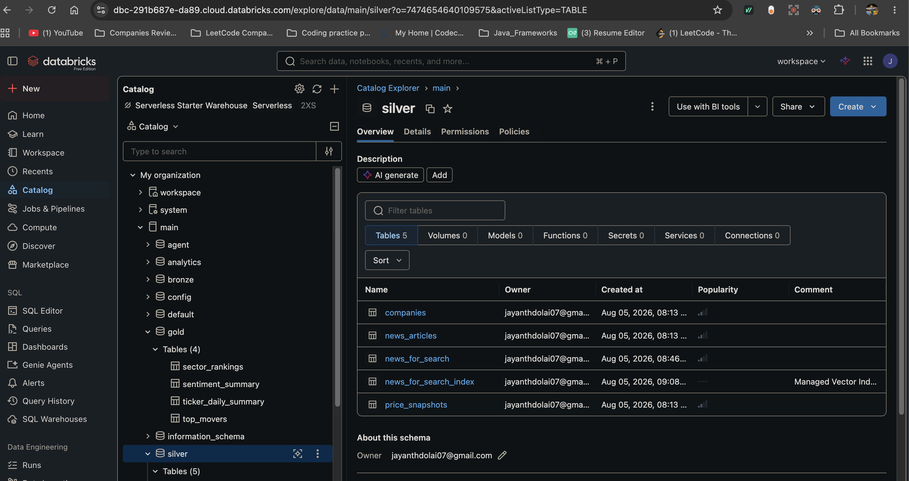

### Transformations Per Table

**`main.silver.companies`** (from `main.bronze.raw_companies`):
- Deduplicate by `ticker` — keep latest `ingested_at` per ticker using `ROW_NUMBER()` window function
- Drop `raw_json` and `batch_id` (Bronze-only columns)
- Normalize exchange codes: `XNAS → NASDAQ`, `XNYS → NYSE`, `XASE → AMEX`, `ARCX → NYSE Arca`
- Derive `market_cap_billions` = `market_cap / 1e9` rounded to 2 decimal places
- Add `processed_at` timestamp

**`main.silver.price_snapshots`** (from `main.bronze.raw_price_snapshots`):
- Deduplicate by `(ticker, snapshot_date)` — keep latest per trading day
- Validate: filter rows where `close <= 0`
- Derive `daily_return_pct` = `((close - open) / open) * 100`
- Derive `price_range` = `high - low`
- Derive `is_up_day` = `close >= open` (boolean flag)
- Round all price columns to 4 decimal places
- Add `processed_at` timestamp

**`main.silver.news_articles`** (from `main.bronze.raw_news_articles`):
- Filter: remove rows with null `article_id` or null `title`
- Deduplicate by `article_id` — keep latest ingested version
- Parse `published_utc` string → proper `TimestampType` column `published_ts`
- Derive `article_age_days` = `datediff(current_date, published_utc)`
- Derive `description_length` = character length of description
- Derive `has_sentiment` = boolean flag (True if sentiment is not null)
- Normalize `sentiment` to lowercase
- Add `processed_at` timestamp

**`main.silver.news_for_search`** is *not* built here — it is created by Phase 5 (`04_embed_and_index.ipynb`) and refreshed on every workflow run by `05_sync_index.ipynb`.

### Notebook Structure (7 cells)

| Cell | Purpose |
|---|---|
| 0 | Markdown — reads from / writes to |
| 1 | Imports, SparkSession, `PROCESSED_AT` timestamp |
| 2 | Create `main.silver` schema |
| 3 | Transform + write `main.silver.companies` |
| 4 | Transform + write `main.silver.price_snapshots` |
| 5 | Transform + write `main.silver.news_articles` |
| 6 | Summary row counts + architecture note |

### Known Issues & Architecture Decisions

| Issue | Decision |
|---|---|
| Lakebase psycopg2 connection fails on Free Edition | Removed Lakebase sync from Silver entirely |
| `w.config.token` returns None in Serverless | Token exchange also blocked (no federation policy on Free Edition) |
| Lakebase OLTP needs data | Populated by AI Agent tools (Phase 7) — correct architecture |
| Test user needed for Agent | Run `INSERT INTO stock_assistant.users` in Lakebase SQL Editor |

### Lakebase Seed (run once in Lakebase SQL Editor)

```sql
INSERT INTO stock_assistant.users (name, email)
VALUES ('Jay Dolai', 'jayanthdolai07@gmail.com')
ON CONFLICT (email) DO NOTHING;

SELECT id, name, email, created_at FROM stock_assistant.users;
```

---

## ✅ Phase 4 — Gold Aggregates

**File:** `pipeline/03_gold_aggregates.ipynb`

### What Gold Does

Gold reads from Silver Delta tables and builds analytics-ready aggregated tables in `main.gold.*`. These tables power the AI Agent tools and the Databricks App frontend. No API calls — pure PySpark aggregations, completing in under 30 seconds in the production workflow.

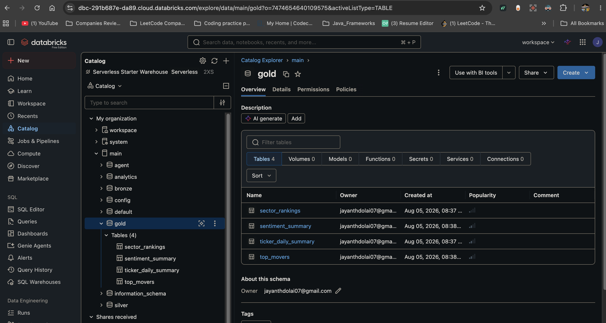

### Gold Tables Produced

**`main.gold.ticker_daily_summary`**
Master fact table joining Silver price + company + sentiment into one row per ticker per day.

> **Sector source:** `sector` is joined from `main.config.ticker_config`, the curated
> five-sector registry. Polygon returns no sector field, so this originally fell back to
> `sic_description` — which is far more granular ("Electronic Computers", "State Commercial
> Banks") and split `sector_rankings` into **13 groups** once all 20 tickers were activated.
> SIC remains a `coalesce` fallback for any ticker missing from the registry.

- All price columns (open, high, low, close, volume, vwap)
- Derived: `daily_return_pct`, `price_range`, `is_up_day`
- Company metadata: name, exchange_name, sector, market_cap_billions
- Sentiment metrics: news_count, avg_sentiment_score, positive/negative/neutral counts

**`main.gold.sector_rankings`**
Sector-level aggregation ranked by total market cap:
- `total_market_cap_billions` — sum of market caps in sector
- `avg_daily_return_pct` — mean return across sector tickers
- `avg_sentiment_score` — mean sentiment across sector news
- `sector_rank` — rank by market cap using `RANK()` window function
- `tickers` — array of all ticker symbols in sector

**`main.gold.sentiment_summary`**
Per-ticker sentiment signal with confidence rating:
- `sentiment_signal` — BULLISH (score > 0.3) / BEARISH (score < -0.3) / NEUTRAL
- `sentiment_confidence` — HIGH (≥8 articles) / MEDIUM (≥4) / LOW (<4)

**`main.gold.top_movers`**
Best and worst performing tickers ranked by daily return:
- `return_rank` — rank by `daily_return_pct` descending
- `mover_type` — GAINER (return > 0) / LOSER (return < 0) / FLAT

### Notebook Structure (8 cells)

| Cell | Purpose |
|---|---|
| 0 | Markdown — reads from / writes to |
| 1 | Imports, SparkSession, `PROCESSED_AT` timestamp |
| 2 | Create `main.gold` schema |
| 3 | Build `ticker_daily_summary` — join price + company + sentiment |
| 4 | Build `sector_rankings` — groupBy sector, rank by market cap |
| 5 | Build `sentiment_summary` — signal + confidence per ticker |
| 6 | Build `top_movers` — rank by daily return, GAINER/LOSER flag |
| 7 | Gold summary — row counts for all 4 tables |

### Key Design Decisions

| Decision | Reason |
|---|---|
| `overwrite` mode on all Gold tables | Gold is always fully recomputed from Silver — no incremental logic needed |
| Sentiment score: positive=1, neutral=0, negative=-1 | Average gives a continuous [-1, 1] signal usable by the Agent |
| `RANK()` not `ROW_NUMBER()` for sector_rank | Handles ties correctly (two equal market caps share the same rank) |
| Gold tables are Agent-readable | Agent tools query Gold for price data and sentiment — fast, pre-aggregated |

### Full Medallion Architecture

```
Massive/Polygon API
        ↓
main.bronze.*    Raw, append-only, full raw_json, batch_id per run
        ↓
main.silver.*    Deduplicated, typed, enriched, no raw_json, CDF enabled
        ↓                            ↓
main.gold.*                    main.analytics.*
Aggregated,                    CDF change events
Agent-queryable                (Phase 6)
        ↓
AI Agent         Reads Gold + AI Search → responds to user queries
        ↓
main.agent.*     Written by Agent (watchlists, notes, reports)
```

---

## ✅ Phase 5 — Embeddings + Vector Search

**File:** `embeddings/04_embed_and_index.ipynb`
**Refreshed by:** `pipeline/05_sync_index.ipynb` (workflow task 5)

### What Phase 5 Does

Builds the semantic search layer that powers the AI Agent's RAG capability. News article text **and company profile descriptions** are embedded using a Databricks Foundation Model and indexed in an AI Search (Vector Search) index. The Agent queries this index to retrieve contextually relevant content for any user question.

### Components Created

| Component | Name | Status |
|---|---|---|
| Source Delta table | `main.silver.news_for_search` | CDF-enabled, has `search_text` column |
| AI Search endpoint | `stock-assistant-vs` | **Ready** — type STANDARD, 1 index |
| AI Search index | `main.silver.news_for_search_index` | **Online** — Delta Sync, managed embeddings |
| Embedding model | `databricks-bge-large-en` | **Ready** |
| Rows indexed | 144 | Sync schedule: Triggered |

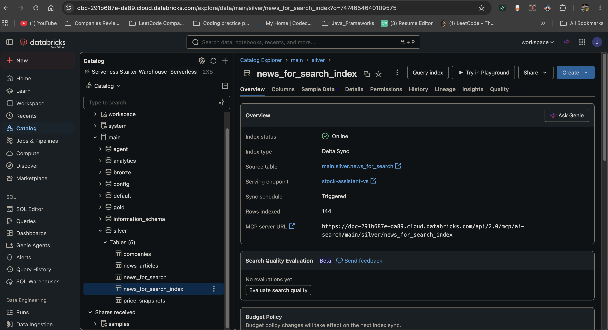

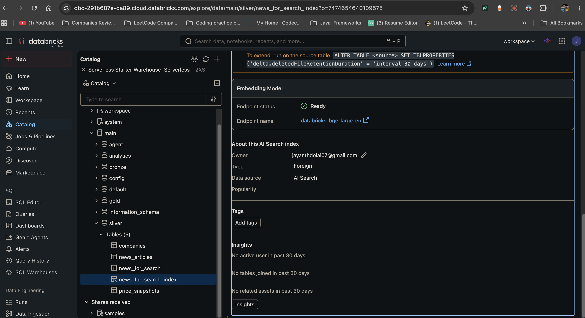

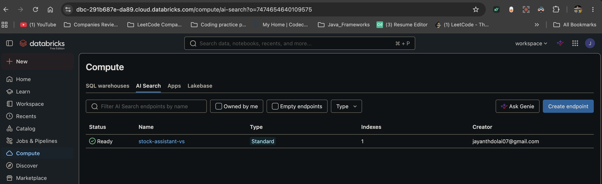

### How It Works

```
main.silver.news_articles  +  main.silver.companies
        ↓ build search_text = "ticker | title | description"
main.silver.news_for_search  (CDF enabled)
        ↓ Delta Sync pipeline (TRIGGERED mode)
AI Search index  (managed embeddings via BGE Large)
        ↓ similarity_search(query_text, num_results=3)
Agent tool: search_news(query)
        ↓ top-k results returned as RAG context
AI Agent response grounded in real news + company facts
```

### Source Table Design

The source table unions two row types so the agent can answer both news questions and "what does this company do?" questions from one index. Company rows use `company_<TICKER>` as the article_id:

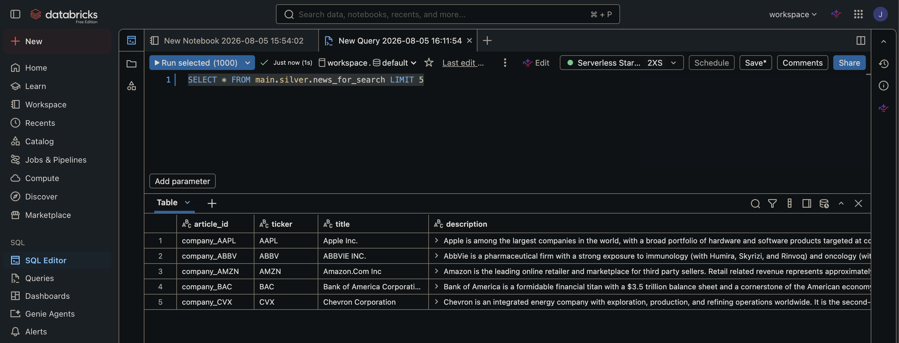

The `search_text` column combines three fields for richer semantic context:
```python
search_text = ticker + " | " + title + " | " + description
# Example: "AAPL | Apple Is Down 10%... | Apple shares fell..."
```

This gives the embedding model more signal than the headline alone:

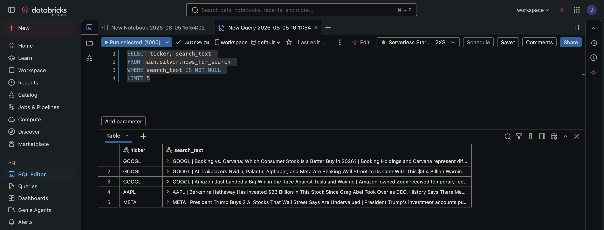

### Notebook Structure (10 cells)

| Cell | Purpose |
|---|---|
| 0 | Markdown description |
| 1 | `%pip install databricks-ai-search` + kernel restart |
| 2 | Imports + config (endpoint/index names, model) |
| 3 | Build `news_for_search` Delta table with CDF enabled (news + company profiles) |
| 4 | Create or verify AI Search endpoint (waits for ONLINE) |
| 5 | Delete stuck index if it exists, then recreate cleanly |
| 6 | Wait for index ready (40 attempts × 30s = 20 min max) |
| 7 | Trigger sync + test semantic search with 3 queries |
| 8 | Manual status check cell — run anytime to check state |
| 9 | Summary |

### Provisioning Stages (Free Edition)

The index goes through 3 stages after creation:
```
PROVISIONING_ENDPOINT           ~5-10 min  (endpoint slice allocation)
       ↓
PROVISIONING_PIPELINE_RESOURCES ~10-15 min (embedding pipeline setup)
       ↓
ONLINE / ready: True                        (semantic search available)
```
Total provisioning time on Free Edition: **20-40 minutes**.

### Known Issues & Fixes

| Issue | Cause | Fix |
|---|---|---|
| `ModuleNotFoundError: databricks.vector_search` | Package not pre-installed on Serverless | Added `%pip install databricks-ai-search` + restart in Cell 1 |
| `databricks-vectorsearch` deprecated | Package renamed to `databricks-ai-search` | Updated pip install + import to `databricks.ai_search.client` |
| `'AISearchIndex' object has no attribute 'get'` | SDK returns object not dict | Use `idx.describe().get(...)` for all status checks |
| Index stuck in `PROVISIONING_ENDPOINT` forever | Index created before endpoint finished provisioning | Delete and recreate index — Cell 5 handles this automatically |
| `PROVISIONING_PIPELINE_RESOURCES` takes 15+ min | Free Edition — 1 VSU, shared resources | Wait loop extended to 40 attempts × 30s = 20 min |
| Auth notice spam on every `VectorSearchClient()` | Default SDK behavior | Added `disable_notice=True` to suppress |
| `BadRequest: Vector index is not ready` | Searched before index finished | Wait for `ready: True` before calling `similarity_search()` |

### Index Configuration

| Parameter | Value | Reason |
|---|---|---|
| `pipeline_type` | `TRIGGERED` | Manual sync control — sync runs when called explicitly by the workflow |
| `primary_key` | `article_id` | Unique identifier per row (`company_<TICKER>` for profile rows) |
| `embedding_source_column` | `search_text` | Rich combined text field |
| `embedding_model_endpoint_name` | `databricks-bge-large-en` | Best available on Free Edition |

### Daily Sync — `pipeline/05_sync_index.ipynb` (4 cells)

| Cell | Purpose |
|---|---|
| 0 | Markdown description |
| 1 | `%pip install databricks-ai-search` + kernel restart |
| 2 | Rebuild `main.silver.news_for_search` from latest Silver (news + company profiles) |
| 3 | Call `idx.sync()`, wait 60s, report `detailed_state` and `ready` |

---

## ✅ Phase 6 — CDF → Delta Analytics

**File:** `cdf/06_cdf_to_delta.ipynb`

### What Phase 6 Does

Captures every row-level change across the Silver Delta tables using Delta Lake's native Change Data Feed, and writes them into a Delta analytics table for pipeline monitoring and usage tracking.

### Architecture Decision

The capstone requires "CDF from Lakebase into a Delta table." Since Lakebase direct connectivity requires OAuth federation (not available on Free Edition), CDF is implemented using **Delta Lake's native `enableChangeDataFeed`** — an architecturally identical concept:

| | Lakebase CDF | Delta CDF (implemented) |
|---|---|---|
| Enable on source | `REPLICA IDENTITY FULL` | `delta.enableChangeDataFeed = true` |
| Change types | INSERT/UPDATE/DELETE | insert/update_postimage/delete |
| Read mechanism | Logical replication stream | `readChangeFeed = true` |
| Output | Delta analytics table | `main.analytics.cdf_events` |

### Tables Created

| Table | Purpose |
|---|---|
| `main.analytics.cdf_events` | Every row-level change event from Silver tables |
| `main.analytics.cdf_summary` | Aggregated pipeline monitoring view |
| `main.analytics.cdf_watermarks` | Last Delta version already captured per source table |

### CDF Events Schema

```
event_id        STRING    — unique event identifier
source_table    STRING    — which Silver table changed
operation       STRING    — INSERT / UPDATE / DELETE
ticker          STRING    — which ticker was affected
record_key      STRING    — primary key of changed row
record_snapshot STRING    — JSON snapshot of changed columns
commit_version  BIGINT    — Delta table version of the change
commit_ts       TIMESTAMP — when the change was committed
captured_at     TIMESTAMP — when CDF pipeline ran
```

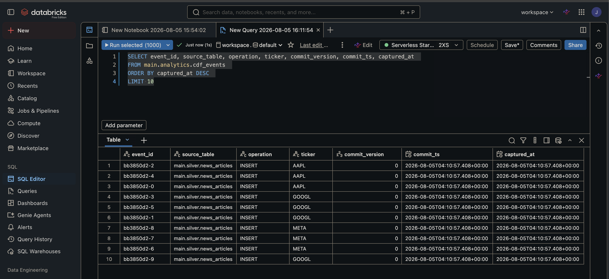

### Results

`main.analytics.cdf_events` — 50 events from the initial snapshot, grouped in `cdf_summary`:

| Source table | Operation | Events |
|---|---|---|
| `main.silver.news_articles` | INSERT | 25 |
| `main.silver.companies` | INSERT | 20 |
| `main.silver.price_snapshots` | INSERT | 5 |

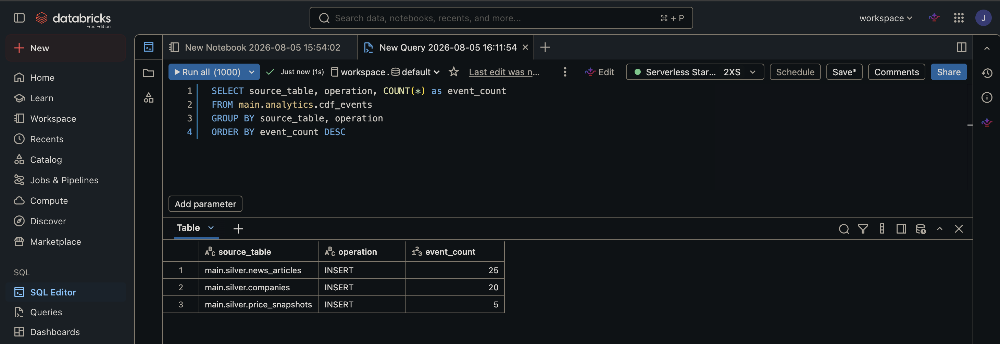

### Incremental Capture (`readChangeFeed` + watermark)

The initial snapshot only covers rows that existed **before** CDF was enabled. Every run
after that reads the actual change feed, so scheduled executions capture real
INSERT / UPDATE / DELETE activity rather than re-snapshotting:

```python
latest = current_version(table)              # DESCRIBE HISTORY <table> LIMIT 1
wm     = get_watermark(table)                # main.analytics.cdf_watermarks

if wm is None:                               # first run after the snapshot
    set_watermark(table, latest)             # start the feed here, don't replay
elif latest > wm:
    changes = (spark.read.format("delta")
               .option("readChangeFeed", "true")
               .option("startingVersion", wm + 1)
               .option("endingVersion", latest)
               .table(table))
    # ... write events, then advance the watermark
    set_watermark(table, latest)
```

Details that matter:

| Concern | Handling |
|---|---|
| `update_preimage` rows | Filtered out — only the post-image is recorded, so one UPDATE = one event |
| Operation naming | `_change_type` normalized: `insert`→INSERT, `update_postimage`→UPDATE, `delete`→DELETE |
| Failed run | Watermark advances **only after** a successful write, so the next run retries the same range |
| First run after snapshot | Watermark initialized to the current version instead of replaying history as duplicates |
| Re-run with no changes | `latest <= wm` → no-op, prints "no new versions" |

### Notebook Structure (10 cells)

| Cell | Purpose |
|---|---|
| 0 | Markdown description |
| 1 | Imports + SparkSession + config |
| 2 | Enable CDF on all Silver tables |
| 3 | Create `main.analytics` schema + `cdf_events` + `cdf_watermarks` tables |
| 4 | Check if table already populated (idempotent guard) |
| 5 | Initial snapshot — treats existing rows as INSERT events |
| 6 | **Incremental capture — `readChangeFeed` since the stored watermark** |
| 7 | Analytics queries on captured events |
| 8 | Build `cdf_summary` aggregate table |
| 9 | Summary and architecture note |

### Known Issue & Fix

| Issue | Cause | Fix |
|---|---|---|
| `DELTA_MISSING_CHANGE_DATA` on version 0 | CDF only records changes AFTER it is enabled — existing rows at version 0 have no CDF data | Treat all current Silver rows as INSERT events via a snapshot function — writes 50 initial events |

### Idempotency

Two guards, one per stage:
- **Snapshot** — the notebook checks `cdf_events.count()` first and skips if already populated
- **Incremental** — the watermark means a re-run with no new Delta versions is a no-op

Together these make the notebook safe to re-run at any time, which is what lets it run as a scheduled workflow task (`cdf_to_delta`).

---

## ✅ Phase 7 — AI Agent with Tools

**File:** `agent/07_agent_tools.ipynb`

### What Phase 7 Does

Implements a fully agentic AI assistant using the Databricks Foundation Models API with OpenAI-compatible function calling. The agent uses an agentic loop — it calls tools iteratively, receives results, and continues until it produces a final answer.

### Model

| Property | Value |
|---|---|
| Model | `databricks-meta-llama-3-3-70b-instruct` |
| API | Databricks Foundation Models (OpenAI-compatible) |
| Auth | Notebook context token via `dbutils` |
| Tool calling | OpenAI function-calling format |
| Max rounds | 5 per query |

### Tools Implemented (11 total)

**Read tools (7):**

| Tool | Source | What it returns |
|---|---|---|
| `get_price_data(ticker)` | `main.gold.ticker_daily_summary` | close, open, high, low, volume, daily_return_pct, market_cap_billions |
| `get_sentiment(ticker)` | `main.gold.sentiment_summary` | sentiment_signal, sentiment_confidence, avg_sentiment_score, news_count |
| `compare_tickers(tickers)` | `main.gold.ticker_daily_summary` | Side-by-side comparison sorted by daily return |
| `get_top_movers(limit=5)` | `main.gold.top_movers` | Top gainers and losers with return rank |
| `search_news(query, num_results=3)` | AI Search index (BGE Large embeddings) | Semantically relevant articles + company profiles with sentiment. Falls back to keyword `LIKE` search if the index is not ready |
| `get_sector_rankings()` | `main.gold.sector_rankings` | Sector market cap + avg return + sentiment, ranked |
| `flag_price_moves(ticker=None, threshold_pct=2.0)` | `main.gold.ticker_daily_summary` | Omit `ticker` to scan every tracked stock; pass one to check it alone. Returns `flagged`, `movers[]`, `message` |

**Write tools (4):**

| Tool | Writes to | What it stores |
|---|---|---|
| `add_to_watchlist(ticker, watchlist_name="My Watchlist")` | `main.agent.watchlists` | ticker + watchlist name + user_email + timestamp |
| `remove_from_watchlist(ticker, watchlist_name="My Watchlist")` | `main.agent.watchlists` | Deletes matching rows |
| `save_research_note(ticker, note)` | `main.agent.research_notes` | Free-text note per ticker |
| `save_analysis_report(ticker, report_text)` | `main.agent.analysis_reports` | Full report + model name + timestamp |

### Agent Write Tables

Three Delta tables in the `main.agent` schema (Lakebase connection not available on Free Edition — Delta used as the equivalent):

```sql
main.agent.watchlists        -- id, user_email, watchlist, ticker, added_at
main.agent.research_notes    -- id, user_email, ticker, note, created_at
main.agent.analysis_reports  -- id, user_email, ticker, report_text, agent_model, generated_at
```

Verified rows written by the agent:

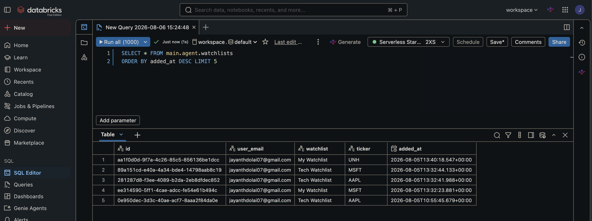

### Agentic Loop Implementation

```python
def run_agent(user_query):
    messages = [system_prompt, user_query]
    for round in range(5):
        response = llm(messages, tools=TOOLS)
        if no tool_calls → return response   # done
        for each tool_call:
            result = execute_tool(tool_call)
            messages.append(tool_result)
        # loop again with updated messages
```

### Notebook Structure (14 cells)

| Cell | Purpose |
|---|---|
| 0 | Markdown description |
| 1 | `%pip install openai databricks-ai-search` + kernel restart |
| 2 | Imports + OpenAI client pointed at Databricks Foundation Models |
| 3 | Create `main.agent.*` write tables |
| 4 | 11 tool function implementations |
| 5 | Tool schemas in OpenAI function-calling format |
| 6 | System prompt + agent runner (agentic loop) |
| 7 | Test 1 — Apple price + sentiment |
| 8 | Test 2 — MSFT vs NVDA comparison |
| 9 | Test 3 — Top movers |
| 10 | Test 4 — News search + save note for NVDA |
| 11 | Test 5 — Add AAPL + MSFT to watchlist |
| 12 | Verify write tables |
| 13 | Summary |

### Actual Agent Test Results

**Test 1 — Apple price + sentiment:**
- Called `get_price_data` → AAPL close $303.42, daily_return -1.99%
- Called `get_sentiment` → neutral signal, high confidence, 10 articles
- Proactively called `add_to_watchlist` without being asked

**Test 2 — MSFT vs NVDA comparison:**
- Called `compare_tickers` → NVDA wins (+4.53%) vs MSFT (+2.42%)
- Proactively saved a research note + added NVDA to watchlist

**Test 3 — Top movers:**
- META +4.98% top gainer, AAPL -1.99% only loser

**Test 4 — AI news RAG search:**
- Called `search_news` with a real AI Search semantic query
- Retrieved an NVDA AI article, saved an intelligent research note from the content

**Test 5 — Watchlist write:**
- Added AAPL + MSFT to "Tech Watchlist" in 2 separate parallel tool calls

### Write Table Results (notebook test run)

| Table | Rows | Content |
|---|---|---|
| `main.agent.watchlists` | 4 | AAPL (My Watchlist), NVDA (My Watchlist), AAPL + MSFT (Tech Watchlist) |
| `main.agent.research_notes` | 2 | NVDA momentum note + NVDA AI sector note |
| `main.agent.analysis_reports` | 0 | Agent chose not to write a report (correct behavior) |

### Known Issues & Fixes

| Issue | Cause | Fix |
|---|---|---|
| `UNSUPPORTED_DATATYPE TEXT` | Delta doesn't support the TEXT type | Replace `TEXT` with `STRING` in all CREATE TABLE statements |
| `databricks-vectorsearch` deprecated | Package renamed to `databricks-ai-search` | Updated pip install + import to use the new name |

---

## ✅ Phase 8 — Databricks App Frontend

**Files:** `app/app.py`, `app/requirements.txt`
**Live URL:** [stock-research-assistant-7474654640109575.aws.databricksapps.com](https://stock-research-assistant-7474654640109575.aws.databricksapps.com)

### What Phase 8 Does

Deploys a Gradio-based chat interface as a Databricks App. The frontend re-implements the Phase 7 AI Agent against the SDK Statement Execution API (no Spark session inside Apps) and provides a live, shareable web UI for stock research.

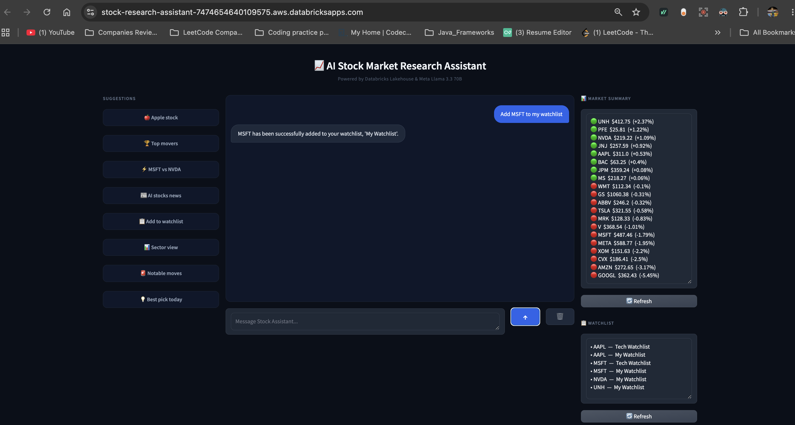

### Architecture

```
Databricks App (Gradio)
       ↓ user message
   agent() — agentic loop, max 5 rounds
       ↓ tool calls
   run_sql() via SDK Statement Execution API   /   VectorSearchClient
       ↓ Gold tables · AI Search index · main.agent.* write tables
   Response rendered as chat bubbles; sidebar refresh shows new writes
```

### App Layout — 3 columns

**Left — Suggestions (8 buttons):**

| Button | Prompt it fills in |
|---|---|
| 🍎 Apple stock | What is Apple's current stock price and sentiment? |
| 🏆 Top movers | What are today's top gainers and losers? |
| ⚡ MSFT vs NVDA | Compare MSFT and NVDA — which has better momentum today? |
| 📰 AI stocks news | Search for recent AI technology stocks news |
| 📋 Add to watchlist | Add Apple to my Tech Watchlist |
| 📊 Sector view | Show me sector rankings and market cap breakdown |
| 🚨 Notable moves | Flag any notable price moves since the last update |
| 💡 Best pick today | Which stock has the best combination of price gain and positive sentiment? |

**Center — Chat:**
- Blue user bubbles, dark assistant bubbles, 500px scrolling pane
- Conversation state (`conv_state`) preserved across turns so follow-ups keep context
- Send with **Enter** or the ↑ button; 🗑️ clears the conversation

**Right — Live data sidebar:**
- **Market Summary** — every tracked ticker with close price and daily return, sorted by return descending, 🟢 for up days and 🔴 for down days
- **Watchlist** — `SELECT DISTINCT ticker, watchlist FROM main.agent.watchlists`
- Independent **Refresh** button under each panel

### Key Differences from the Phase 7 Notebook

| Aspect | Phase 7 Notebook | Phase 8 App |
|---|---|---|
| Spark session | `SparkSession.builder` | Not used |
| Data access | PySpark DataFrame API | SDK Statement Execution API (`run_sql()`) |
| LLM call | `openai` client | `WorkspaceClient.api_client.do()` → serving endpoint |
| Auth | `dbutils` token | App service principal (automatic in Databricks Apps) |
| SQL construction | PySpark DataFrame API | Named parameter markers (`:ticker`) — no string interpolation |
| Warehouse | n/a | First RUNNING SQL warehouse, resolved and cached at startup |
| Deployment | Run in notebook | Deployed as a Databricks App with a public URL |

### Deployment Steps

1. Push `app/app.py` and `app/requirements.txt` to GitHub
2. Pull in the Databricks Git folder
3. Go to **Compute → Apps → Create App**
4. Name: `stock-research-assistant`
5. Source: point to the `app/` folder in your workspace; entry point `app.py`
6. Click **Deploy** — Databricks builds and hosts the app
7. Run `lakebase/grants.sql` so the App identity can read Gold and write to `main.agent.*`
8. Open the generated URL to access the live chat interface

### App Dependencies (`app/requirements.txt`)

```
openai>=1.0.0
databricks-ai-search>=0.1.0
databricks-sdk>=0.20.0
```

---

## ✅ Unity Catalog Grants

**File:** `lakebase/grants.sql`

### When to run

Run this file **once** in the following situations:

| When | Why |
|---|---|
| After running all pipeline notebooks for the first time | App cannot see tables without grants |
| After creating a new schema or table | New objects need explicit grants |
| Before deploying or testing the Databricks App | App runs under the `account users` identity |

### How to run

1. Go to **SQL Editor** in Databricks
2. Make sure the warehouse is **Serverless**
3. Paste the contents of `lakebase/grants.sql`
4. Select all → click **Run selected**
5. All statements should return **OK**

### What is granted

| Grant | Tables | Privilege |
|---|---|---|
| Catalog access | `main` | `USE CATALOG` |
| Schema access | `main.gold`, `main.silver`, `main.agent`, `main.analytics`, `main.bronze`, `main.config` | `USE SCHEMA` |
| Gold tables | `ticker_daily_summary`, `sentiment_summary`, `top_movers`, `sector_rankings` | `SELECT` |
| Silver tables | `news_articles`, `news_for_search` | `SELECT` |
| Agent tables | `watchlists`, `research_notes`, `analysis_reports` | `SELECT + MODIFY` |
| Config table | `ticker_config` | `SELECT` |

### Why `MODIFY` instead of `INSERT`

Unity Catalog metastore version 1.0 (used on Free Edition) does not support `INSERT` as a table privilege. Use `MODIFY`, which covers INSERT, UPDATE, and DELETE on Delta tables.

### Known issue

```
ErrorClass=INVALID_PARAMETER_VALUE.PRIVILEGE_NOT_APPLICABLE_TO_ENTITY
Privilege INSERT is not applicable to this entity
```
**Fix:** replace `INSERT` with `MODIFY` in all GRANT statements.

---

## ✅ Workflow Automation — Daily Pipeline

**Job name:** `stock-assistant-daily-pipeline`
**Job ID:** `620376219385835`

### Tasks (5 total)

| # | Task | Notebook | Compute | Depends on | Duration |
|---|---|---|---|---|---|
| 1 | `bronze_ingestion` | `pipeline/01_bronze_ingestion` | Serverless | — | ~13m 14s |
| 2 | `silver_transform` | `pipeline/02_silver_transform` | Serverless | bronze_ingestion | ~23s |
| 3 | `cdf_to_delta` | `cdf/06_cdf_to_delta` | Serverless | silver_transform | ~19s |
| 4 | `gold_aggregates` | `pipeline/03_gold_aggregates` | Serverless | silver_transform | ~27s |
| 5 | `sync_vs_index` | `pipeline/05_sync_index` | Serverless | gold_aggregates | ~1m 37s |

Tasks 3 and 4 fan out in parallel from `silver_transform` — CDF capture does not block Gold aggregation.

**Latest run** — run ID `165389275773657`, Aug 06 2026 03:04 PM → 03:20 PM, **15m 45s, Succeeded**. Lineage: 12 upstream, 13 downstream tables.

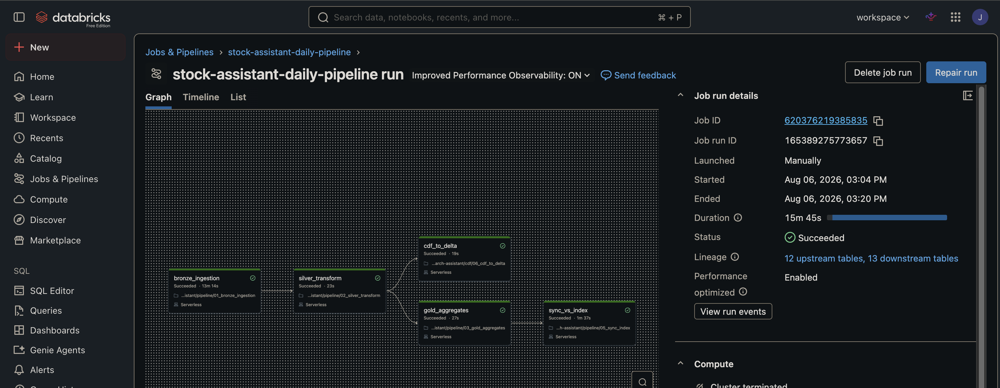

The earlier 4-task version of the job, before `cdf_to_delta` was added — run ID `417545250444084`, 15m 49s, Succeeded:

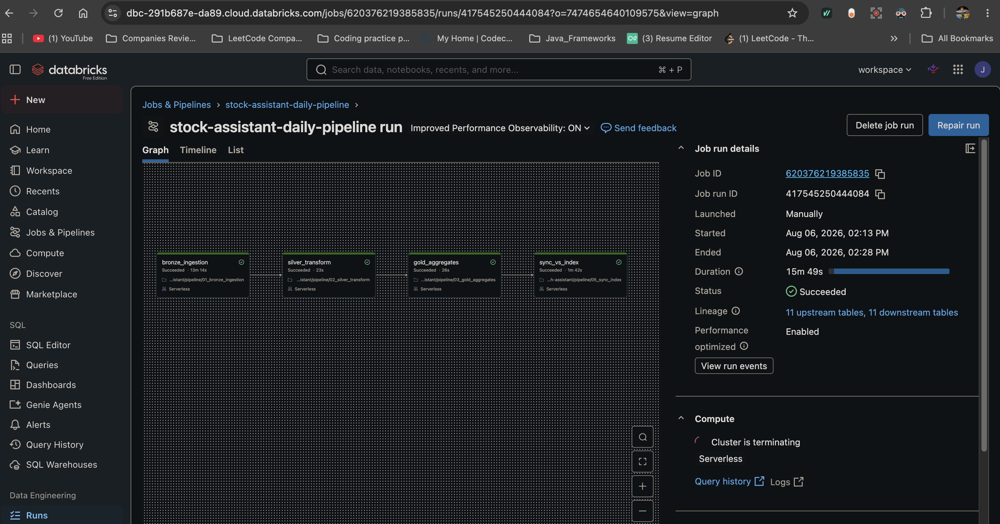

### Schedule

```
Cron     : 0 0 22 ? * MON-FRI
Timezone : Asia/Calcutta (UTC+05:30)
Meaning  : 10 PM IST every weekday = after US market close (4:30 PM UTC)
```

### How to trigger manually

Go to **Jobs & Pipelines → stock-assistant-daily-pipeline → Run now**

### Expected runtime

```
bronze_ingestion  ~13 min  (API rate limit: 20 tickers × 3 endpoints × 13s sleep)
silver_transform  ~23 sec
cdf_to_delta      ~19 sec   ┐ run in parallel
gold_aggregates   ~27 sec   ┘
sync_vs_index     ~1.6 min
──────────────────────────
Total             ~16 min
```

Nearly the entire runtime is the Bronze API rate-limit sleep. Everything downstream of the API is sub-minute.

### What it does end to end

```
Polygon/Massive API (20 active tickers)
        ↓ bronze_ingestion
main.bronze.raw_companies / raw_price_snapshots / raw_news_articles
        ↓ silver_transform
main.silver.companies / price_snapshots / news_articles
        ↓ cdf_to_delta              ↓ gold_aggregates
main.analytics.cdf_events      main.gold.ticker_daily_summary / sector_rankings
main.analytics.cdf_summary                / sentiment_summary / top_movers
                                            ↓ sync_vs_index
                    main.silver.news_for_search (refreshed) → AI Search index synced
                                            ↓
        Databricks App sidebar shows fresh prices on the next Refresh click
```

---

## ✅ Project Complete

```
✅ Phase 0  — Workspace setup                       (GitHub, Databricks, Secrets)
✅ Phase 1  — Lakebase schema, 8 tables             (lakebase/05_schema_ddl.sql)
✅ Phase 2  — Bronze ingestion, Polygon API         (pipeline/01_bronze_ingestion.ipynb)
✅ Phase 3  — Silver transformation                 (pipeline/02_silver_transform.ipynb)
✅ Phase 4  — Gold aggregates, 4 tables             (pipeline/03_gold_aggregates.ipynb)
✅ Phase 5  — Embeddings + AI Search, 144 rows      (embeddings/04_embed_and_index.ipynb)
✅ Phase 6  — Delta CDF → analytics, 50 events      (cdf/06_cdf_to_delta.ipynb)
✅ Phase 7  — AI Agent, 11 tools (7 read + 4 write) (agent/07_agent_tools.ipynb)
✅ Phase 8  — Databricks App, live public URL       (app/app.py)
✅ Workflow — Daily pipeline, 5 tasks, Mon-Fri 10 PM IST
✅ Grants   — Unity Catalog access for the App      (lakebase/grants.sql)
```

---

## Workspace Reference

| Item | Value |
|---|---|
| Workspace URL | `dbc-291b687e-da89.cloud.databricks.com` |
| Cloud | AWS |
| Edition | Databricks Free Edition |
| Unity Catalog | Enabled — catalog `main` |
| Schemas | `bronze` · `silver` · `gold` · `analytics` · `agent` · `config` |
| Secret scope | `capstone` |
| Secret key | `massive_api_key` |
| API base URL | `https://api.polygon.io` |
| Git repo | `demonjd2026-afk/ai-stock-research-assistant` |
| Runtime | Serverless |
| Lakebase project | `stock-assistant` |
| Lakebase schema | `stock_assistant` |
| AI Search endpoint | `stock-assistant-vs` |
| Job ID | `620376219385835` |
| App URL | `stock-research-assistant-7474654640109575.aws.databricksapps.com` |

---

## Security Checklist

- [x] No API keys hardcoded in any notebook
- [x] No secrets committed to GitHub
- [x] All secrets via `dbutils.secrets.get()` at runtime
- [x] `getpass` used for interactive secret entry
- [x] `setup_secrets` notebook deleted after use
- [x] App reads data through the Databricks App service principal, not a personal token

---

## Screenshot Index

Every screenshot in [`screenshots/`](screenshots/) and where it appears:

| File | Shows |
|---|---|
| `01_workflow_run_success.png` | Original 4-task job run — Succeeded, 15m 49s |
| `02_unity_catalog_bronze.png` | Unity Catalog `main.bronze` — 3 tables |
| `03a_unity_catalog_silver.png` | Unity Catalog `main.silver` — 5 objects incl. managed index |
| `03b_unity_catalog_gold.png` | Unity Catalog `main.gold` — 4 tables |
| `04a_api_integration_code.png` | API key from Secrets + `api.polygon.io` base URL |
| `04b_api_ingestion_output.png` | Bronze ingestion summary — 20/20/118 rows this run |
| `05a_vector_search_index_online.png` | AI Search index Online, 144 rows indexed |
| `05b_vector_search_embedding_model.png` | `databricks-bge-large-en` endpoint Ready |
| `05c_vector_search_endpoint_ready.png` | `stock-assistant-vs` endpoint Ready |
| `06a_semantic_search_source.png` | `news_for_search` rows — company profiles included |
| `06b_semantic_search_text.png` | `search_text` = ticker \| title \| description |
| `07a_cdf_analytics_table.png` | `main.analytics.cdf_events` rows |
| `07c_cdf_analytics_summary.png` | CDF event counts by source table |
| `08_workflow_with_cdf.png` | Current 5-task job run incl. `cdf_to_delta` |
| `09_app_watchlist_write.png` | Live Databricks App — agent write + sidebar |
| `10_agent_watchlist_table.png` | `main.agent.watchlists` rows written by the agent |
| `11_bronze_merge_idempotent.png` | Delta MERGE metrics — 20 source rows, 0 inserted |
| `12_bronze_dedupe_verified.png` | Bronze `rows = distinct_keys` on all three tables |
| `13_bronze_lineage_preserved.png` | Distinct `batch_id`s surviving across ingestion dates |
| `14_bronze_news_insert_only.png` | News MERGE history — v14 updates 0 rows (insert-if-absent) |
| `15a_cdf_watermarks.png` | `cdf_watermarks` — last captured Delta version per source |
| `15b_cdf_watermarks.png` | `cdf_events` by version — reaches v14, past the v0 snapshot |
| `16_agent_research_notes.png` | `main.agent.research_notes` written by `save_research_note` |
| `17_agent_analysis_reports.png` | `main.agent.analysis_reports` written by `save_analysis_report` |
| `18_agent_write_tables_summary.png` | All three agent write tables populated |
| `19_app_flag_price_moves.png` | Live app — report saved, and `flag_price_moves` scanning all tickers |

---

## File Structure

```
ai-stock-research-assistant/
├── .gitignore
├── README.md
├── SETUP.md
├── RESUBMISSION.md                     ✅ Reviewer note — changes since the graded snapshot
├── capstone_final.pdf                  Capstone submission document
├── lakebase/
│   ├── 05_schema_ddl.sql               ✅ 8 Lakebase Postgres tables
│   ├── grants.sql                      ✅ Unity Catalog grants for the App
│   ├── verify_agent_writes.sql         ✅ Proof queries for agent writes / idempotency
│   └── cleanup_bronze_duplicates.sql   ✅ One-time dedupe of pre-MERGE backlog
├── pipeline/
│   ├── 00_setup_config.ipynb           ✅ Ticker registry (Unity Catalog)
│   ├── 01_bronze_ingestion.ipynb       ✅ Raw ingestion (Massive/Polygon API)
│   ├── 02_silver_transform.ipynb       ✅ Clean, deduplicate, enrich
│   ├── 03_gold_aggregates.ipynb        ✅ Analytics aggregates (4 Gold tables)
│   └── 05_sync_index.ipynb             ✅ Refresh source + sync AI Search index
├── embeddings/
│   └── 04_embed_and_index.ipynb        ✅ AI Search endpoint + index + RAG test
├── cdf/
│   └── 06_cdf_to_delta.ipynb           ✅ Delta CDF → analytics tables
├── agent/
│   └── 07_agent_tools.ipynb            ✅ AI Agent (11 tools: 7 read + 4 write)
├── app/
│   ├── app.py                          ✅ Gradio frontend (Databricks App)
│   └── requirements.txt                ✅ App dependencies
└── screenshots/                        ✅ 16 proof-of-execution screenshots
```

---

*Last updated: August 6, 2026*
